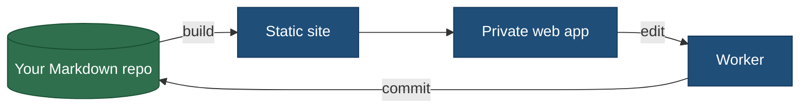

#  WebVault

**Your Markdown vault, on the web.**

Read, edit and selectively share your notes — without changing how your vault
works.

[Deploy the template](https://github.com/marconucara/web-vault-template) ·
[Add to an existing vault](#add-webvault-to-your-existing-vault) ·
[Deploy](DEPLOY.md) · [Design decisions](INDEX.md)

## What you get

- **Read anywhere.** Your whole vault in a browser, laid out for a phone as well
  as a desktop.
- **Edit visually.** A WYSIWYG block editor that writes back plain Markdown.
- **Share single notes.** Publish one note as an isolated public link; the rest
  of the vault stays private.
- **Keep plain Markdown.** No database, no proprietary format — still just files
  in a git repository.

## Your vault stays yours

WebVault doesn't introduce a proprietary format and doesn't replace your
existing workflow. Your vault remains Markdown in git; WebVault is simply
another interface on top of it. It is one way to work with your vault, not the
only one — and not necessarily the main one.

It works with generic Markdown vaults, and is compatible with
[Tolaria](https://github.com/refactoringhq/tolaria) and Obsidian vaults.

## Get started

Two onboarding paths — pick the one that fits.

### Start from a template (near one-click)

No vault yet, and want the fastest path? Deploy the starter template to
**Cloudflare Workers** in a few clicks — you get a running instance with a small
sample vault, then point it at your own notes. See the
[starter template](https://github.com/marconucara/web-vault-template) for the
**Deploy to Cloudflare** button and its setup steps.

### Add WebVault to your existing vault

Already have a Markdown vault? Hand this one-line prompt to any coding agent
working inside your vault:

> Add WebVault to this vault by reading and following
> https://github.com/marconucara/web-vault/blob/v0.11.1/SETUP.md

The agent scaffolds the `.web/` config shell and adds WebVault as a dependency.
[`SETUP.md`](SETUP.md) is the supported install path. The natural next step is
to [test it locally](SETUP.md#3-test-locally-optional-needs-node-yarn) or
[deploy](#deploy) to see the result.

## Why

WebVault started from a vault I already kept in
[Tolaria](https://github.com/refactoringhq/tolaria). Its opinionated
organization solved most of how I capture and structure notes — but two things I
relied on were out of reach: reading my vault comfortably on mobile, and sharing
a handful of notes with other people. WebVault fills exactly those gaps — a
browser-based reader and editor that works on a phone, and isolated public share
links — while leaving the plain-Markdown vault and the way it's organized
untouched.

Because the vault is just a git repository of Markdown files, you can keep
editing it however you like: I do most of my editing through coding agents
(Claude Code, Jules, Codex…), which also makes it comfortable to work from a
phone. WebVault adds a visual reader, a WYSIWYG editor, and public sharing on
top of that — use as much or as little of it as you want.

## How it works

WebVault ships as a framework: one package owns all the app code and the build
pipeline, and your vault keeps only a thin config shell (a `.web/` folder) — no
app code, no bundler config to maintain.

Your notes are read **at build time** and baked into a static site, so there is
no read-time backend. Edits made in the browser go through a small Worker that
**commits them straight back to your vault repo** — one clean commit per save,
and the GitHub token never leaves the server. Notes you choose to share become
isolated public pages; everything else stays behind Cloudflare Access.

## Deploy

Deploying is optional, but it's where WebVault delivers its real value.

Currently the supported target is **Cloudflare Workers**: a static site (served
by a single Worker) behind **Cloudflare Access**, with only `/shared/*` public
and the private vault never exposed. Full steps in [`DEPLOY.md`](DEPLOY.md).

## Design decisions

The [`adr/`](adr/) catalogue is the source of truth for what this system does
and why; [`INDEX.md`](INDEX.md) is the generated table of contents. Contributor
rules are in [`AGENTS.md`](AGENTS.md) and [`CONVENTIONS.md`](CONVENTIONS.md).

## License

AGPL-3.0.
